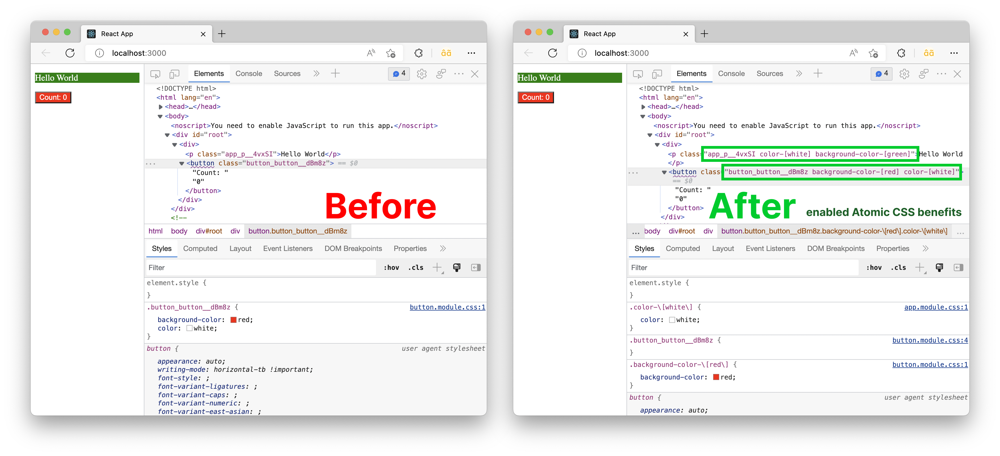

# MatoCSS

Transform CSS Modules to enable Atomic CSS benefits

_Please note that it is still experimenting. I do not recommend using this in production._



## Usage

MatoCSS only supports Webpack now.

### Webpack

You need to install our loader first.

```
npm install @matocss/webpack
```

Update `webpack.config.js` to add our loader for CSS Modules files.

Make sure you put the loader in the last to work.

See the example [here](./examples/create-react-app/config/webpack.config.js#L507-L527).

```javascript
{
  test: cssModuleRegex,
  use: [
    // ... another loaders
    { loader: "@matocss/webpack" },
  ],
},
```

## License

[MIT](./LICENSE) License © 2022-Present [Huy Nguyen](https://github.com/huyng12)
